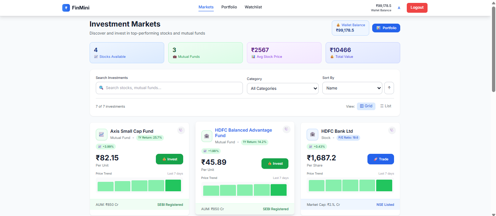

# 🏦 FinMini - Financial Trading Platform

> **Full-Stack Developer Assignment** by [Your Name]  
> **Submission Date**: September 28, 2025  
> **Live Demo**: [Your Vercel URL] | **API**: [Your Railway URL]

## 📋 Assignment Requirements Met

✅ **Authentication & KYC** - JWT-based login/signup with PAN verification  
✅ **Product Listing** - 7 Indian stocks/mutual funds with P/E ratios & returns  
✅ **Product Details** - Interactive charts using Chart.js  
✅ **Transactions** - Buy functionality with wallet deduction  
✅ **Portfolio Dashboard** - Invested amount, current value, returns calculation  
✅ **Watchlist** - Add/remove products feature  

## 🚀 Bonus Features Implemented

✅ **Real-time Updates** - Socket.io for live price updates  
✅ **Admin Panel** - Role-based access (admin@finmini.com / admin123)  
✅ **Modern UI** - Professional fintech-grade design with Tailwind CSS  
✅ **Responsive Design** - Mobile-optimized interface  

## 🛠️ Tech Stack

**Backend:**
- Node.js + Express.js
- MongoDB (Mongoose ODM)
- JWT Authentication
- Socket.io (Real-time)
- Multer (File uploads)

**Frontend:**
- React + Vite
- Tailwind CSS
- Chart.js + react-chartjs-2
- React Router DOM
- Axios (API calls)

## 🚀 Quick Start

### Prerequisites
- Node.js 18+
- MongoDB running on localhost:27017

Backend
cd backend
npm install
npm run seed # Seeds products and demo users
npm run dev # Port 5000

Frontend
cd frontend
npm install
npm run dev # Port 5173

## 👤 Demo Credentials

**User**: test@demo.com / password123 (₹100,000)  
**Admin**: admin@finmini.com / admin123 (₹500,000)

## 📹 Demo Video Features

✅ KYC signup process with PAN & document upload  
✅ Product listing with 7 investment options  
✅ Interactive charts and trading interface  
✅ Buy transactions with wallet deduction  
✅ Portfolio dashboard with returns tracking  
✅ Watchlist management  
✅ Admin panel overview (bonus) 

